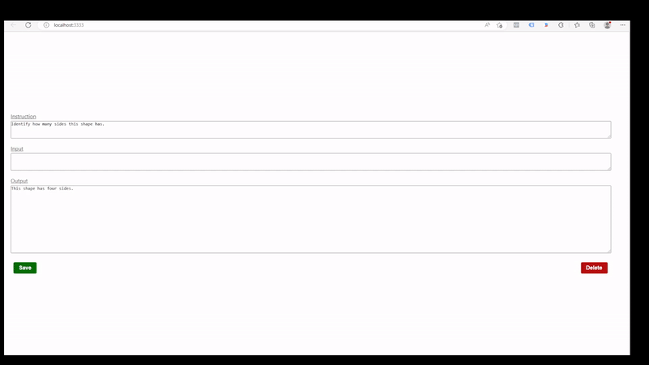

# Simple local web interface
Make sure you've got NodeJS installed. https://nodejs.org/en/download

In your command line, if you're at the root of the project, first 

`cd gui`

The first time, run this to install the dependencies

`npm i`

Then run

`node index.js`

Then the site will run on `http://localhost:3333` 

It'll autoload them at random, then you can save changes (or leave it the same and hit save) or delete. 

It will live save those changes to the actual `alpaca_data_cleaned.json` file, while keeping local track of what you've already seen. That way when it loads a new random one, it won't get any repeats for you. 

Should make iteraing through way faster, smoother, and less wondering about "wait did I already check all these ones?"

Here's a quick example of using it, along with GitHub desktop showing the dif in the data file.
