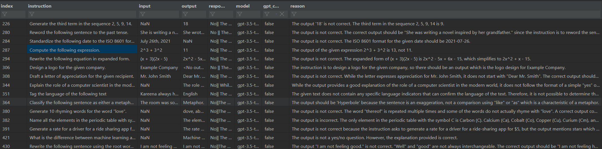

# OpenAI GPT Model-Based Alpaca Data Validator
Original project: https://github.com/josemlopez/check-with-gpt.

This script is designed to validate Alpaca data using OpenAI GPT models, such as text-davinci-003, gpt-3.5-turbo, and gpt-4. The primary goal is to check if the provided outputs are correct, given the instructions and input data. The script reads the data, sends prompts to the GPT API, and saves the results, making it a valuable tool for quality assurance and data validation.

## Why this script can be useful
* Automating data validation: This script helps to automate the process of validating large amounts of data using OpenAI GPT models.
* Quality assurance: By leveraging the power of GPT models, you can ensure the data you're working with is accurate and reliable.
* Save time and resources: Manual data validation can be a time-consuming and error-prone process. This script allows you to offload some of that work to GPT models, freeing up your resources for other tasks.

## How to use this script
1. Install the required packages listed in the requirements.txt file.
2. Create a config_check_with_gpt file with the required parameters, such as input and output paths, GPT model.
3. Create a **my_secrets.py** with a only one variable **OPENAI_API_KEY** containing your OpenAI API key.
example: 
```python
OPENAI_API_KEY = "sk-xxxxxxxxxxxxxxxxxxxxxxxxxxxxxxxxxxxxxxxx"
```
4. Make sure the input data is in the correct format (JSON).
5. Run the script using the command python check_with_gpt.py.

# Result: 
The script will then read the input data, send prompts to the specified GPT model, and save the results in a CSV file. You can review the generated file to analyze the GPT model's responses and validate the data.

This is an example of the output file generated by the script:



# Adapting the Script to other APIs
This script is designed to work with the OpenAI GPT models, but it can be adapted to work with other language model APIs. 
To modify the script for another API, follow these steps:

1. Replace the openai import statement with the appropriate import statement for the new API.
2. Update the **my_secrets.OPENAI_API_KEY** variable with the API key for the new service.
3. Modify the openai_gpt function to use the new API's request format and response handling. This may include updating the API endpoint, input parameters, and the way the response is parsed.
4. Update the Config class and config.ini file to include any additional parameters required by the new API.
5. Ensure that any API-specific constants or model names are updated to reflect the new service.
6. Test the script with the new API to ensure it is functioning correctly and producing the desired output.

By following these steps, you can adapt the script to work with different language model APIs, allowing for greater flexibility and the ability to use the most suitable language model for your specific use case.

Note: When adapting the script for other APIs, be sure to thoroughly read and understand the new API's documentation to ensure you are using it correctly and efficiently. Additionally, be aware of any rate limits, usage restrictions, or costs associated with the new API to prevent unexpected issues or expenses.


